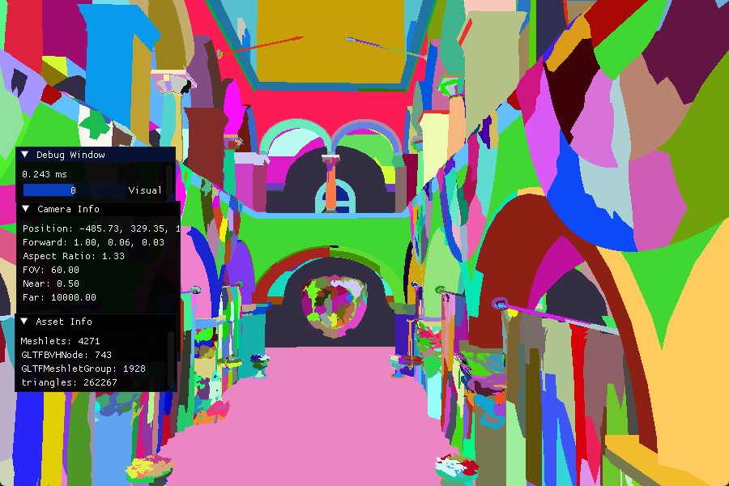
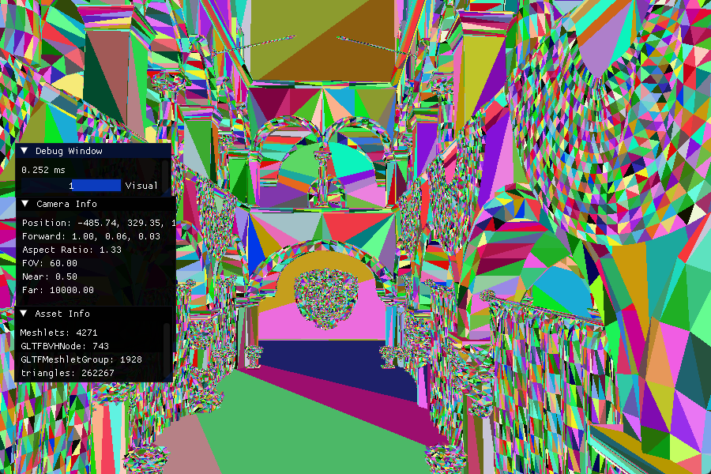

# cannele
A simple engine for computer graphics learning

## Features Overview
### 1. Rendering Core
- **RHI Layer**:
  - Vulkan
- **Platform**
  - windows
- **Renderer Capabilities**:
  - Automatic **Resource State Tracking** and **Barrier Insertion**
  - Automatic management of **Staging Buffers** (allocation & release)
  - Full **Bindless Resource** support
  - Utilizes **Descriptor Buffer** extensions
  - **Timeline Semaphore** replaces traditional fences for efficient GPU synchronization
  - **Resource Pool** for Buffers and Textures with garbage collection
  - **Asynchronous Uploader** for optimized GPU resource uploads
  - **Mesh pipeline** support

### 2. System Modules
- **Virtual File System (VFS)** for unified asset access
- **Window System** for cross-platform window management
- **First-Person Camera** with smooth movement and rotation

### 3. Runtime Features
- **Reflection System**:
  - Type registration and runtime metadata access
  - Allows querying object types and properties at runtime
- **Asset System**:
  - GLTF asset import pipeline implemented
  - Converts imported assets into engine-native format
  - Asset saving & management to be implemented

### 4. Shader Management
- Integrated **Slang** shader compiler
- **Shader Factory**:
  - Register and instantiate shader modules easily
  - Supports runtime shader module combination for flexible rendering pipelines

## Gallary
- GPU-driven pipeline:
    
    meshlet visualization.
    
    triangle visualization.
## Future Plans
- Complete **Asset System** saving and management
- Expand **Shader Factory** with runtime module combination and hot reload
- Add support for additional RHI backends (DirectX12 / Metal)
- Basic **Render Graph** implementation
  - Supports resource dependency tracking and pass scheduling

## Quick Start
First, clone the repository and build it using Xmake. Since the repository does not include any assets, you will need to download a GLTF model and put it into the assets directory. After that, update the import path in engine/graphics/renderer/deferred_renderer.cpp accordingly.
